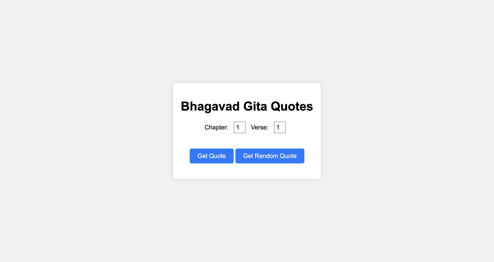

# Bhagavad Gita Quotes

Welcome to the Bhagavad Gita Quotes web application! This app is designed to help you explore and discover quotes from the Bhagavad Gita, offering wisdom and inspiration. You can either select specific chapters and verses or get a random quote every time you click the "Get Random Quote" button.

## Features
- **Fetch Specific Quotes:** Select a chapter and verse to get a specific quote from the Bhagavad Gita.
- **Random Quote:** Discover a random quote every time you click the "Get Random Quote" button.
- **Error Handling:** Robust error handling to ensure meaningful error messages and smooth usage.
- **Simple and Easy-to-Use Interface:** Designed with utmost simplicity for an easy and intuitive user experience.
- **Dropdown Selection:** Easily select chapters and verses from dropdown lists to fetch specific quotes.

## Technologies Used
- HTML
- Vanilla CSS
- JavaScript
- API (for fetching data)

# API Integration
This application uses the [Bhagavad Gita API](https://bhagavadgitaapi.in/) to fetch quotes from the Bhagavad Gita.

## Installation
To set up the Brewery Finder API locally, follow these steps:

1. Clone the repository.
2. Switch to Existing_API_Collection folder `cd Existing_API_Collection`
3. Navigate to the `Bhagavad_Gita_API` directory.
4. Open the `index.html` file in your browser.

## Screenshot

