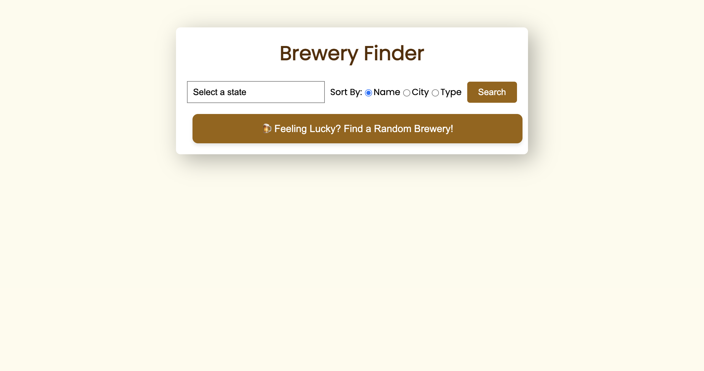

# Brewery Finder

Welcome to the Brewery Finder API! This API is designed to help you explore the world of breweries by providing detailed information about various breweries across different states. Just select a state, and I'll guide you to discover exciting breweries near you!

## Features
- **Fetch Detailed Information about Breweries:** Get comprehensive data about breweries, including their name, type, city, state, country, phone, and website URL.
- **Random Brewery:** Discover a random brewery every time you click the "Random Brewery" button.
- **Error Handling:** Robust error handling to ensure meaningful error messages and smooth API usage.
- **Simple and Easy-to-Use Interface:** Designed with utmost simplicity for an easy and intuitive user experience.
- **Search Functionality:** Easily search for breweries by selecting a state from the dropdown list.
- **Sort Breweries:** Sort breweries alphabetically by name, city, or type.

## Technologies Used
- HTML
- Vanilla CSS
- JavaScript
- API ( for fetching data )

# API Integration
This application uses the [Open Brewery DB API](https://www.openbrewerydb.org/documentation/01-listbreweries) to fetch brewery data.

## Installation
To set up the Brewery Finder API locally, follow these steps:

1. Clone the repository.
2. Switch to Existing_API_Collection folder `cd Existing_API_Collection`
3. Navigate to the `Brewery_API` directory.
4. Open the `index.html` file in your browser.

## Screenshot
