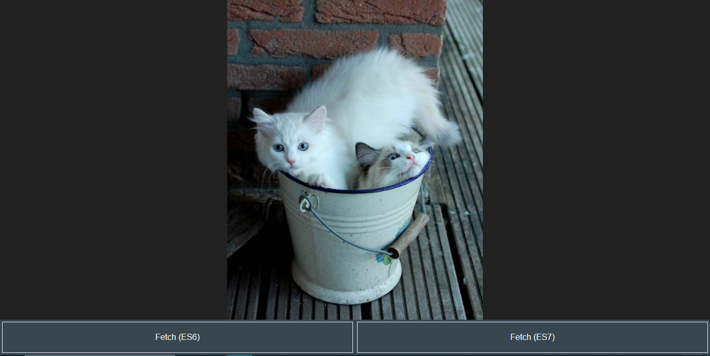

# Cat Images API

Welcome to the Cat Images API! This API fetches and displays random cat images using The Cat API. It provides a simple web page with buttons to fetch cat images using both ES6 and ES7 JavaScript syntax.

## Features
- **Fetch Cat Images:** Retrieve random cat images by clicking on the "Fetch (ES6)" or "Fetch (ES7)" buttons.
- **Error Handling:** Robust error handling to ensure smooth image loading even in case of network errors.
- **Loader Animation:** A loader animation appears while the image is being fetched, providing visual feedback to users.
- **Responsive Design:** Designed with responsiveness in mind, ensuring a seamless experience across different devices and screen sizes.

## Technologies Used
- HTML
- CSS (with flexbox for layout and keyframe animation for loader)
- JavaScript (ES6 and ES7 syntax)
- Fetch API for making HTTP requests

## API Integration
This application uses The Cat API (`https://api.thecatapi.com/v1/images/search`) to fetch random cat images.

## Usage
To use the Cat Images API:

1. Open the `index.html` file in a web browser.
2. Click on either "Fetch (ES6)" or "Fetch (ES7)" button to fetch and display a new random cat image.
3. The loader animation will appear while the image is being fetched and disappear once the image is loaded.

## Installation
To set up the Cat Images API locally, follow these steps:

1. Clone the repository.
2. Navigate to the directory containing the `index.html` file.
3. Open the `index.html` file in a web browser.

## Screenshots

