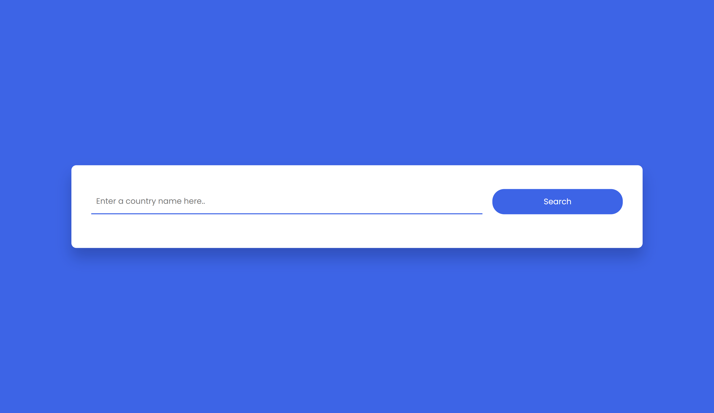
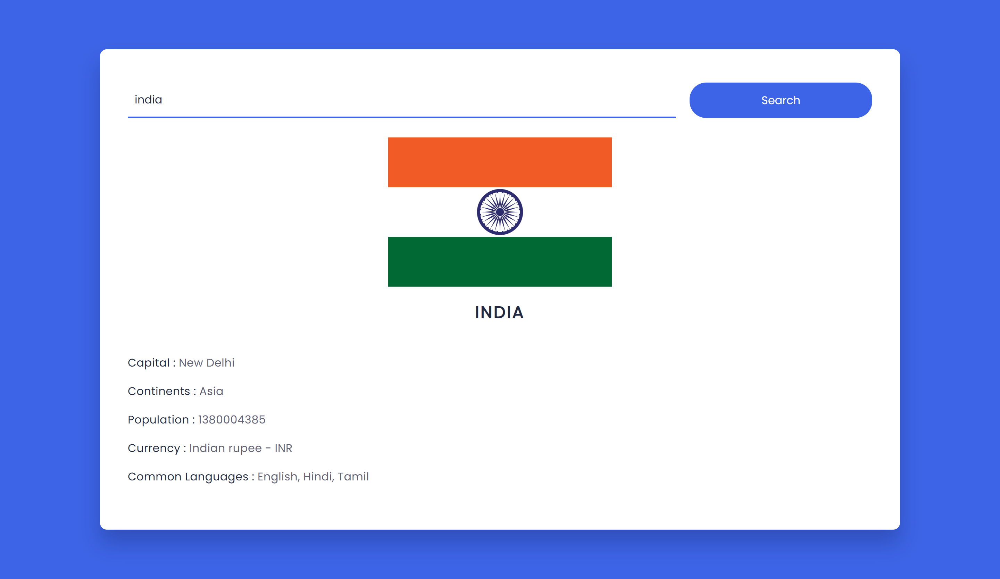

## Table of Contents

- [About](#about)
- [How to use](#how-to-use)
- [Build with](#build-with)
- [Author](#author)
- [Contributors](#contributors)

## About

[Country API](https://github.com/developer-student-clubs/APIVerse/tree/master/Existing_API_Collection/CountryAPI) is a REST API that provides information about countries including name, flag, capital, continent, population, currency, languages, etc.

## How to use

- Clone the repository from [APIVerse](https://github.com/developer-student-clubs/APIVerse)
- Open the folder Existing_API_Collection > CountryAPI
- Copy the path of index.html file
- Paste the path in your browser
- You will see the following page
- 
- Type the name of the country in the search box and click on search
- You will see the following page
- 
- Click on the name of the country to see the details

## Build with

- HTML
- CSS
- JavaScript
- [Rest-Countries API](https://restcountries.com/v3.1/)

## Author

- Mahek-Garala [GitHub](https://github.com/Mahek-Garala)
- Mahek Garala [LinkedIn](https://www.linkedin.com/in/mahek-garala-179911261/)

## Contributors

