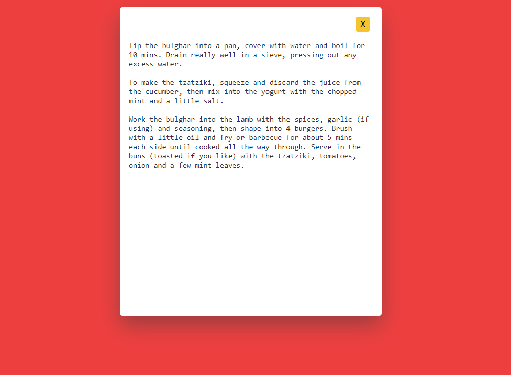

# Dictionary API
In this project, we make use of the MealDB API. This API is easy to use. I would suggest this project for people who have basic knowledge of fetch()

## Features
- The project consists of search input and a search button. The user enters the dish name of his choice into this input and hits the search button. When the user clicks on the search button, it displays an image of the respective meal, its name, and the country of origin.

Along with this, we also show a list of ingredients along with the measure. Next to the ingredients, we have a ‘View Recipe’ button. When the user clicks on this button, a pop up opens up with the instructions to cook the meal.
## Technologies Used
- HTML
- CSS
- JavaScript
- API ( for fetching data )

# API Integration
This application uses `https://www.themealdb.com/api/json/v1/1/search.php?s=` to fetch the data.

## Installation
To set up the Dictionary API locally, follow these steps:

- Clone the repository
- Switch to Existing_API_Collection folder `cd Existing_API_Collection`
- Now switch to CountryAPI folder `cd FoodRecipe_API`
- Run command `.\/index.html`

## Screenshots
)

