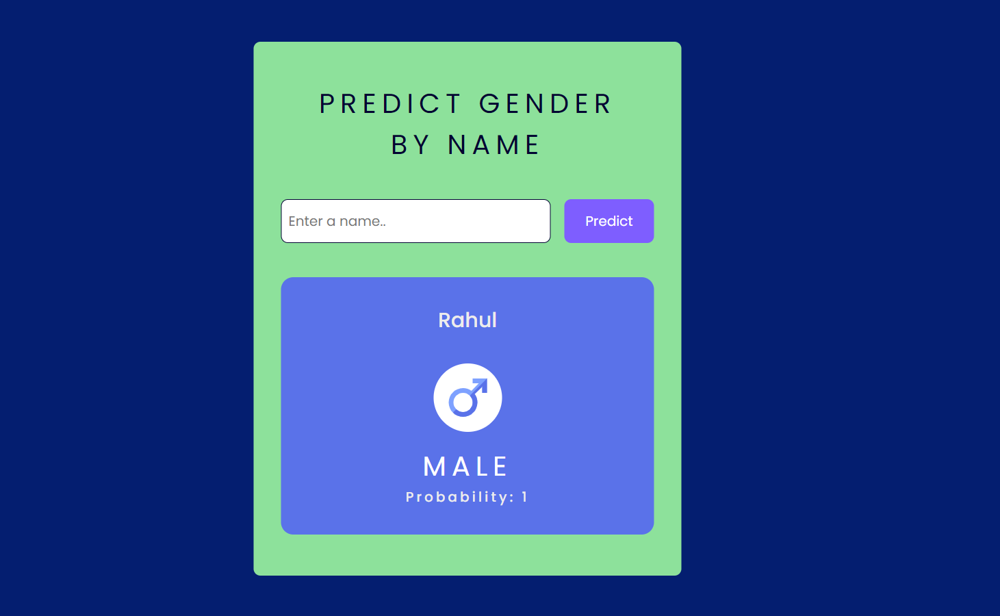

# Predict Gender By Name (Genderize API)

A simple web application that predicts the gender of a person based on their name using the Genderize API.

## Tech Stack

- HTML

- CSS

- JS

## API used

[Genderize Api](https://genderize.io/)

## Usage

1. Clone the repository:

2. Open the `index.html` file in your web browser.

3. Enter a name in the input field and click on the predict button

4. The application sends a request to the Genderize API.

5. The predicted gender and probability are displayed on the web page.

## Use case

- User Demographics Analysis: Segment email subscribers by gender for targeted marketing campaigns.
- Content Personalization: Recommend relevant content based on predicted gender.
- Customer Service Enhancement: Tailor chatbot responses to provide a personalized user experience.

## Screenshot

