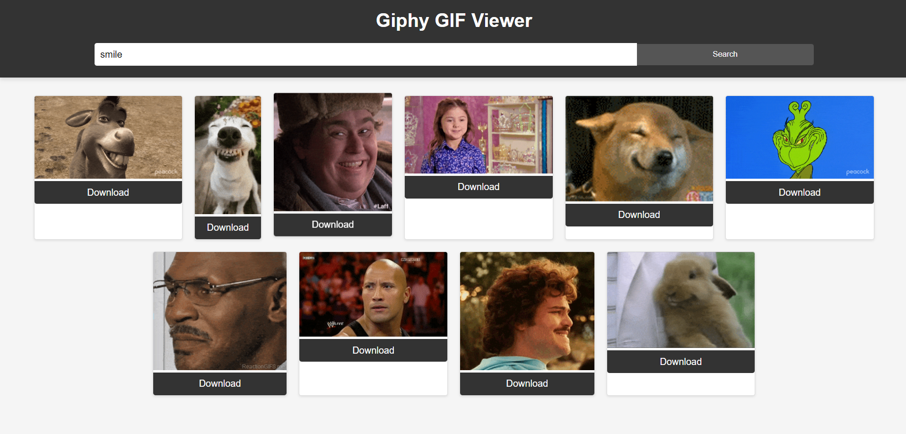

GIPHY API:
-This API allows developers to integrate Giphy's vast library of GIFs into their own applications, websites, and services.
-Each GIF in the Giphy library comes with rich metadata, including titles, tags, source URLs, and user information.

Future Scope:
-Future iterations of the Giphy API may support more interactive GIFs that allow users to interact with elements within the GIF itself. 
- Developers may have access to more detailed analytics and insights related to the usage of GIFs through the API.

Implementation:
-The JavaScript code contains an HTTP request to the GIPHY API's and authenticated api key, it fetches list of gifs from api and show it to users with downloading it functionality.

Tech Stacks used:
 - HTML (frontend)
 - CSS (styling)
 - Javascript (API Implementation)

Output :

Reference:
https://developers.giphy.com/dashboard/