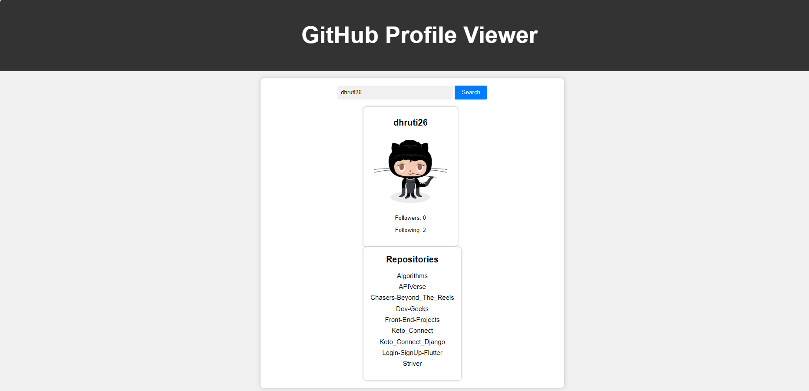

Github API:
-It is a set of web-based endpoints and tools provided by GitHub to allow developers to programmatically interact with and access data from the GitHub platform.
-It enables developers to build applications, automate tasks, and integrate GitHub's functionality into their own software applications or services.

Future Scope:
-The API can be used to integrate security scanning and compliance checks into the development process.
-The API could be used to gather data for advanced reporting, analytics, and visualization tools.

Implementation:
-The JavaScript code contains an HTTP GET request to the GitHub API's ,the API is sent to GitHub's servers after authentication, it fetches user's profile data from its database.

Tech Stacks used:
 - HTML (frontend)
 - CSS (styling)
 - Javascript (API Implementation)

Output :

Reference:
https://docs.github.com/en/rest?apiVersion=2022-11-28
