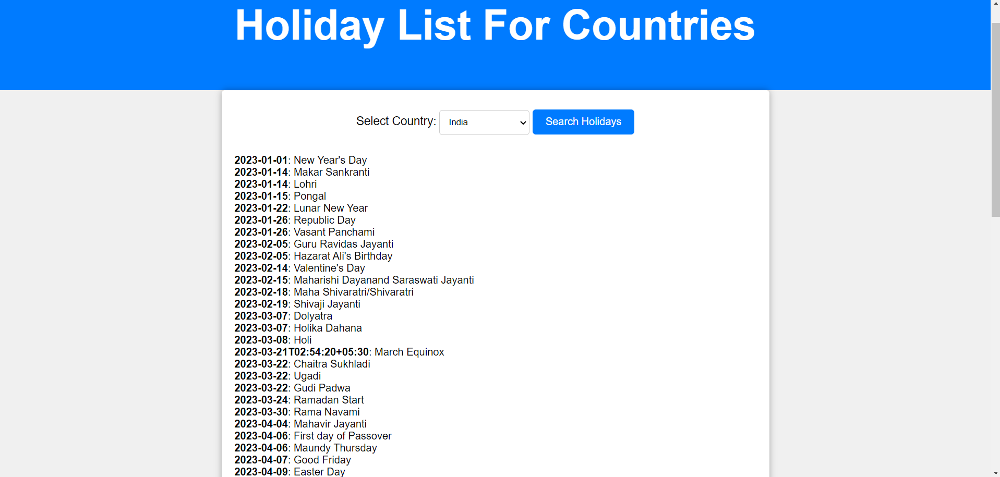

GlobalHoliday API:
-The Calendarific Global Holidays API covers over 230 countries and 3000 states around the world.
 An API key is required for every request to the Holiday API.
-It enables Access to Worldwide Holiday Data,saves times,provides Accuracy and Reliability.
-This API can be useful for promoting cultural awareness and inclusivity by providing information about holidays and celebrations from diverse cultures and regions.

Future Scope:
-The Global Holiday API may continue to add more countries and regions to their holiday databases, ensuring broader global coverage. 
-Improvements in data accuracy and real-time updates will be a major focus. 
-Integration with AI and automation tools can help businesses predict and plan for holiday-related events and trends

Implementation:
-The JavaScript code contains an HTTP request to the Global Holiday API's along with country code and authenticated api key, it fetches list of holidays for selected country.

Tech Stacks used:
 - HTML (frontend)
 - CSS (styling)
 - Javascript (API Implementation)

Output :

Reference:
https://calendarific.com/api-documentation