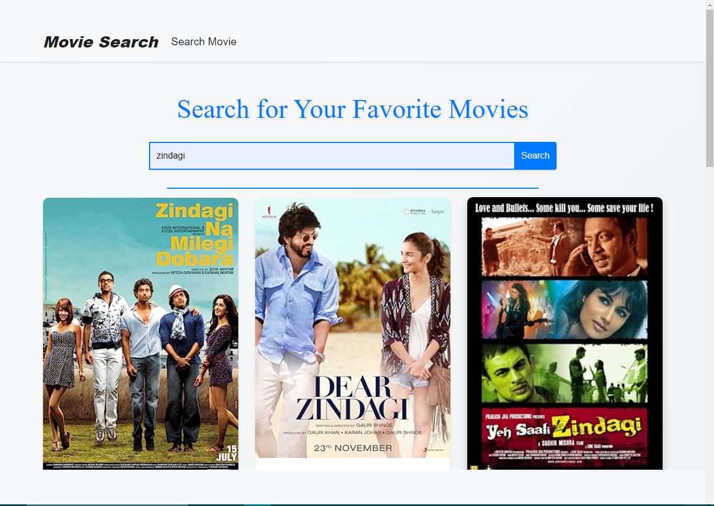

## Movie Search App

### Overview

This project is a simple web application that utilizes the OMDB API to allow users to search for movies and view detailed information about them. Users can search for movies by title, and the application dynamically fetches data from the OMDB API to display movie posters, titles, years, and other details in a user-friendly format.

### Features

- **Search Functionality:** Users can enter a movie title in the search input and click the "Search" button or press Enter to fetch relevant movies.
- **Movie Details Modal:** Clicking on "See details" in each movie card opens a modal displaying additional information such as plot summary, release date, genre, ratings, and more.
- **Responsive Design:** The application is designed using Bootstrap 4, ensuring it works well across different devices and screen sizes.
- **Error Handling:** Provides error messages if the API request fails or no movies match the search criteria.

### Tech Stack

- **HTML:** Provides the structure of the webpage.
- **CSS (Bootstrap):** Styles the webpage for a modern and responsive layout.
- **JavaScript (jQuery):** Handles API requests to OMDB, updates the DOM based on search results, and manages interactions like modal display.

### Setup

To run this project locally:

1. Clone the repository.
2. Open `index.html` in your web browser.

### Usage

1. Enter a movie title in the search input field.
2. Click the "Search" button or press Enter.
3. Browse through the list of movies displayed.
4. Click on "See details" to view more information about a specific movie.

### API Key

You need to obtain an API key from OMDB (or use your own if you have one) and replace `'apikey': '166b57cd'` in `script.js` with your key.

### File Structure

- `index.html`: Main HTML file defining the structure and content of the webpage.
- `style.css`: Custom CSS styles for enhancing the appearance and layout.
- `script.js`: JavaScript file containing the logic for interacting with the OMDB API and handling user actions.

### Credits

- **Bootstrap:** Used for styling and responsive design.
- **OMDB API:** Provides movie data for search and details.

### Demo

### License

This project is licensed under the MIT License. See the [LICENSE](LICENSE) file for details.
