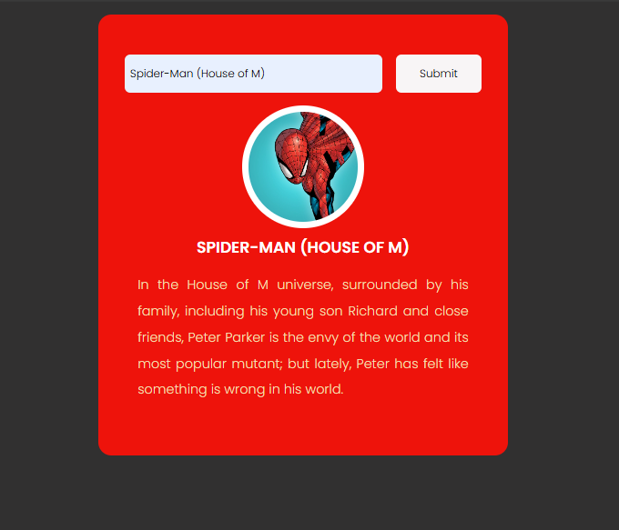

# Marvel API App

Marvel API App is a simple web application that allows users to search for Marvel characters and view detailed information about them using the Marvel API.

## Features

- Search Marvel Characters: Type in the name of a Marvel character to search for matching results.
- Autocomplete Suggestions: Get autocomplete suggestions as you type in the search box.
- Character Details: View detailed information about each character, including their name, image, and description.

## Screenshots



## Technologies Used

- HTML
- CSS
- JavaScript
- [Marvel API](https://developer.marvel.com/)

## Getting Started

### Prerequisites

To run this project locally, you will need:

- A modern web browser (Chrome, Firefox, Safari, etc.)
- Internet connection

### Installation

1. Clone the repository:

```sh
git clone https://github.com/your-username/marvel-api-app.git
cd marvel-api-app
Open index.html in your browser to view the application.
```

### Configuration

- Sign up for an API key at Marvel Developer Portal.
- Get your public and private keys from your Marvel Developer account.
- Replace the placeholder keys in the script.js file with your actual keys:
```
const publicKey = 'your_public_key';
const privateKey = 'your_private_key';
```
