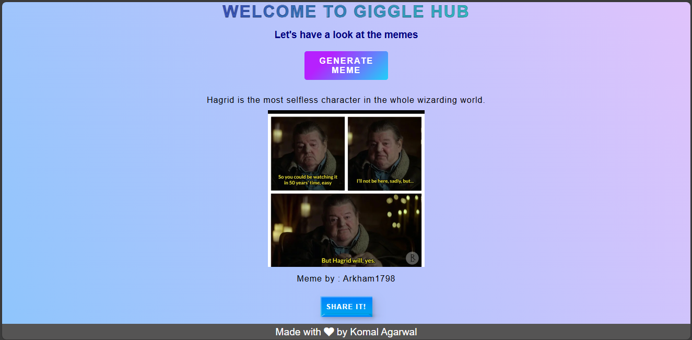

# Meme Generator

This is a random meme generator web application built using HTML, CSS, and JavaScript. It allows users to generate random memes by using the technique of API Fetching.

## Tech Stack

- HTML

- CSS

- JS

## Extra feature

- If you like the meme you can also share it with others using the share button provided at the bottom

## Usage

1. Clone the repository:

2. Open the `index.html` file in your web browser.

3. Click on generate meme button and see the meme appear on your screen

4. You can also share the meme in case you liked it.

5. Click on share button and spread the laughter.

## Deployed version

- https://giggle-hub.vercel.app/

## Screenshot

