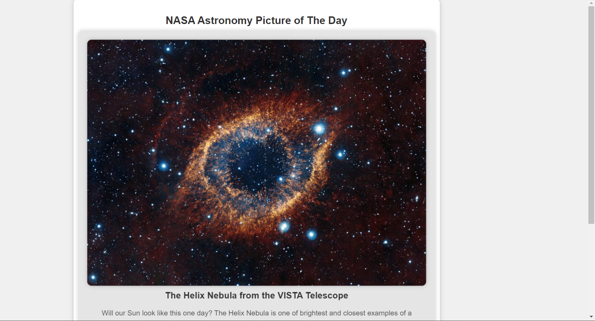

NASA APOD(Astronomy Picture of The Day) API:
-The APOD API provides access to the Astronomy Picture of the Day, which showcases a different astronomical image or photograph each day along with a brief explanation written by a professional astronomer.

Future Scope:
-Enhance the API with additional educational content, such as interactive lessons, quizzes, and facts related to each APOD image.
- Implement AI algorithms to provide personalized content recommendations based on users' interests and viewing history.

Implementation:
-The JavaScript code fetch response from api and  cache is used for fast access,store it in list for later accessing previous and next APOD image and information.

Tech Stacks used:
 - HTML (frontend)
 - CSS (styling)
 - Javascript (API Implementation)

Output :

Reference:
https://api.nasa.gov/
