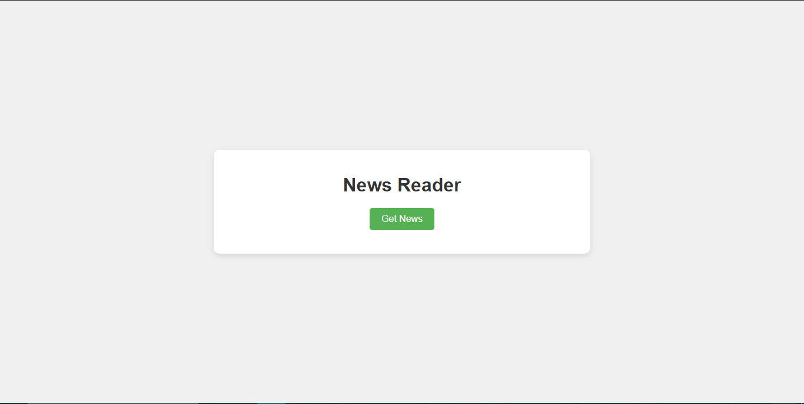

# News Reader API

Welcome to the News Reader API! This API allows you to fetch the latest news articles from various sources. Simply click the "Get News" button, and I'll provide you with the most recent headlines!

## Features
- **Fetch Latest News Articles:** Retrieve the most recent news articles from various sources.
- **Simple User Interface:** Designed with simplicity in mind, making it easy to use.
- **Error Handling:** Robust error handling ensures smooth API usage, providing meaningful error messages when necessary.

## Technologies Used
- HTML
- CSS
- JavaScript
- API (for fetching news data)

# API Integration
This application uses an external API to fetch news data. The specific API endpoint and details can be found in the script.js file.

## Installation
To set up the News Reader API locally, follow these steps:

1. Clone the repository.
2. Navigate to the directory where the repository is cloned.
3. Open the `index.html` file in a web browser.

## Screenshots

