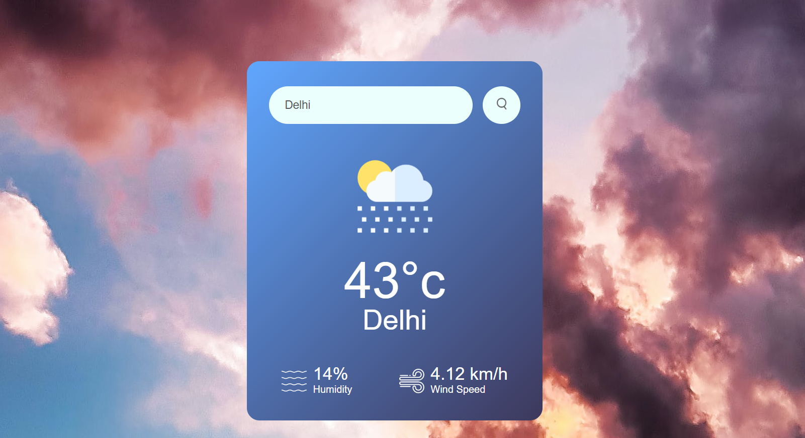

# OpenWeatherMap API

The OpenWeatherMap API provides weather data for various locations. The API allows you to fetch current weather data, forecasts, and historical data, making it a comprehensive solution for weather-related applications.

## Table of Contents

- [Features](#features)
- [Getting Started](#getting-started)
- [Technologies Used](#technologies-used)
- [Demo](#screenshot)
- [Reference](#reference)

## Features

The OpenWeatherMap API provides a range of weather data, including but not limited to:

- **Temperature**: Current temperature of the entered location.
- **Wind Speed**: Current wind speed and direction.
- **Humidity**: Current humidity levels.

## Getting Started

- Before you begin, ensure you have a free or paid OpenWeatherMap API key. You can get it by signing up at [OpenWeatherMap](https://openweathermap.org/api)
- Clone the repository to your local machine.

   ```sh
   git clone https://github.com/username/repo_name.git
   ```
- Add your OpenWeatherMap API key to the script.js file.
- Open the index.html file in your web browser.

## Technologies Used

- **HTML** : For providing the structure
- **CSS**: For styling the web page
- **JavaScript**: For API fetching and display

## Screenshot


## Reference
For more detailed information, refer to the official [OpenWeatherMap API Documentation](https://openweathermap.org/guide).