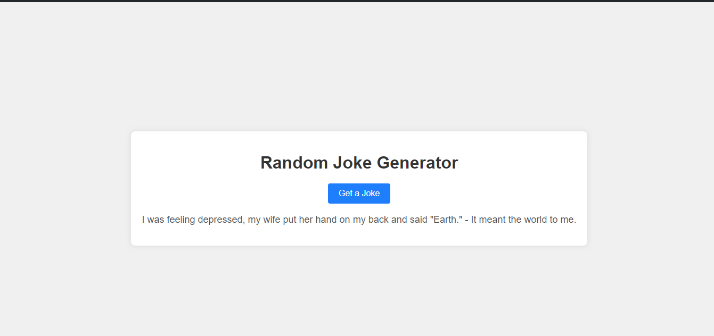

# Random Joke API

Welcome to the Random Joke API! This API is designed to bring humor into your applications by providing a wide range of jokes. Whether you need a quick one-liner or a setup with a punchline, this API has got you covered!

## Features
- **Random Jokes:** Fetch jokes randomly from various categories, including programming, miscellaneous, and more.
- **Single-Line and Two-Part Jokes:** Get both single-line jokes and jokes with setups and punchlines.
- **Error Handling:** Robust error handling ensures informative error messages for smooth integration.
- **Simple Integration:** Easy-to-use API interface makes integration seamless.

## Technologies Used
- Node.js
- Express.js
- JavaScript
- RESTful API design principles

# API Integration
This API can be integrated into your application by making HTTP requests to the following endpoint:

```
GET https://v2.jokeapi.dev/joke/Any
```

Replace `Any` in the endpoint with the desired category of the joke. Available categories include `Any`, `Miscellaneous`, `Programming`, `Pun`, `Spooky`, `Christmas`, and more.

## Installation
To set up the Random Joke API locally, follow these steps:

- Clone the repository
- Navigate to the RandomJokeAPI folder
- Install dependencies with `npm install`
- Start the server with `npm start`
- The API will be accessible at `http://localhost:3000`

## Usage
To fetch a random joke, make a GET request to the endpoint specified above. The API will respond with a JSON object containing the joke.

Example Request:
```
GET https://v2.jokeapi.dev/joke/Any
```


## Screenshots


