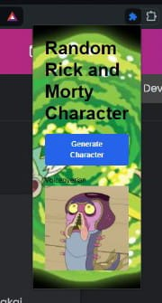

# Random Rick and Morty Extension

This extension generates a random Rick and Morty Images whenever it is clicked.

## Installation Instructions

1. **Open your browser**: Launch your preferred web browser (e.g., Chrome, Edge).

2. **Enable Developer Mode**:
    - Navigate to the extensions page. You can typically do this by typing `chrome://extensions/` in the address bar for Chrome or `edge://extensions/` for Edge.
    - Toggle the **Developer mode** switch in the top right corner of the extensions page.

3. **Load the Extension**:
    - Click on the **Load unpacked** button.
    - In the file dialog that appears, navigate to the directory where your project files are located and select the folder containing `manifest.json`.

4. **Activate the Extension**:
    - After loading the extension, an icon will appear in the extensions toolbar.
    - Click on this icon to generate and view a random Anime quote.

## Project Structure

- `manifest.json`: The manifest file that contains metadata about the extension.
- `index.html`: The HTML file for the extension's popup interface.
- `script.js`: The JavaScript file that handles the logic to fetch and display random Rick and Morty images.

## Screenshot

Here is what the extension looks like when activated:

## Additional Information

- Ensure all necessary files (`manifest.json`, `index.html`, `script.js`, and any additional assets) are in the same directory.
- If you make any changes to the code, you will need to reload the extension by clicking the reload icon next to the extension on the extensions page.

---

Enjoy your random Rick and Morty Extension!