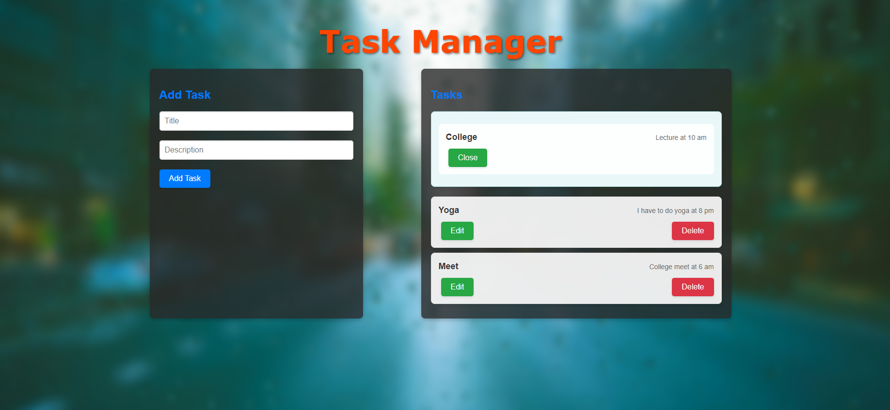

# Task Manager API

## Project Description

The Task Manager API is a simple yet effective task management application built using Flask. This application allows users to create, read, update, and delete tasks. It features a clean user interface and supports basic task management operations.

## Features

- Add new tasks with title and description.
- View a list of tasks with options to edit or delete.
- Responsive design with a modern, dark-themed UI.
- Background image with blur effect for an enhanced visual experience.

## Technologies Used

- **Flask**: A lightweight WSGI web application framework for Python that provides the core functionality of the application.
- **Werkzeug**: A comprehensive WSGI web application library that Flask uses for utility functions.
- **JavaScript (Fetch API)**: Used for making asynchronous HTTP requests to the backend API.
- **CSS**: Provides styling and layout for the frontend, including responsiveness and visual effects.
- **HTML**: Structure of the user interface.

## Installation
Ensure you have a virtual environment set up and activate it. Then, install the required dependencies:

pip install -r requirements.txt

### Prerequisites

- Python 3.9 or higher
- Flask
- Werkzeug

## Screenshot
