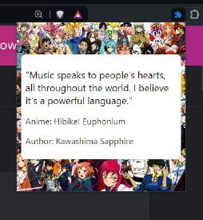

# Random Anime Quote Extension

This extension generates a random Anime quote whenever it is clicked.

## Installation Instructions

1. **Open your browser**: Launch your preferred web browser (e.g., Chrome, Edge).

2. **Enable Developer Mode**:
    - Navigate to the extensions page. You can typically do this by typing `chrome://extensions/` in the address bar for Chrome or `edge://extensions/` for Edge.
    - Toggle the **Developer mode** switch in the top right corner of the extensions page.

3. **Load the Extension**:
    - Click on the **Load unpacked** button.
    - In the file dialog that appears, navigate to the directory where your project files are located and select the folder containing `manifest.json`.

4. **Activate the Extension**:
    - After loading the extension, an icon will appear in the extensions toolbar.
    - Click on this icon to generate and view a random Anime quote.

## Obtaining the API Key

To fetch Anime quotes, you need an API key from Waifu.it. Follow these steps to get your API key:

1. **Visit Waifu.it**: Open your web browser and go to [Waifu.it](https://waifu.it/).
2. **Sign Up or Log In**: If you don't have an account, sign up for a new one. If you already have an account, log in.
3. **Generate API Key**: Once logged in, navigate to the API section of the website. There you will find an option to generate a new API key. Copy this key, as you will need it for your extension.

## Adding the API Key

1. **Edit `script.js`**: Open the `script.js` file in a text editor.
2. **Insert API Key**: Locate the placeholder for the API key and insert your key. It should look something like this:
    ```javascript
        headers: {
        'Authorization': 'YOUR-API-KEY'
    }
    ```
3. **Save the File**: Save your changes to `script.js`.

## Project Structure

- `manifest.json`: The manifest file that contains metadata about the extension.
- `index.html`: The HTML file for the extension's popup interface.
- `script.js`: The JavaScript file that handles the logic to fetch and display random Anime quotes.

## Screenshot

Here is what the extension looks like when activated:



## Additional Information

- Ensure all necessary files (`manifest.json`, `index.html`, `script.js`, and any additional assets) are in the same directory.
- If you make any changes to the code, you will need to reload the extension by clicking the reload icon next to the extension on the extensions page.

---

Enjoy your random Anime quotes!