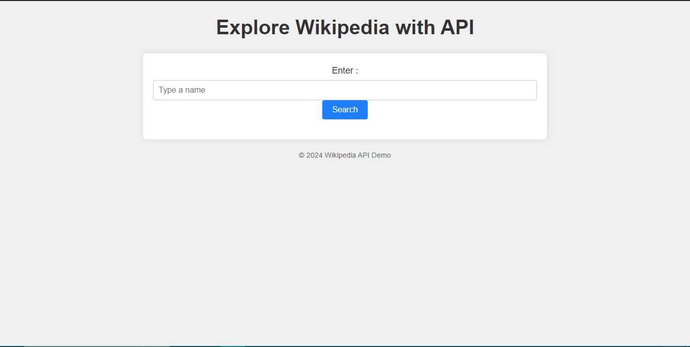

## Wikipedia API

### Overview
This project demonstrates a simple webpage that utilizes the Wikipedia API to allow users to search and retrieve information about topics of interest. The webpage provides a user-friendly interface where users can input a search term, and upon submission, it fetches relevant data from Wikipedia's API asynchronously.

### Features
- **Search Functionality:** Users can enter a search term (e.g., a person's name) and retrieve summarized information from Wikipedia.
- **Dynamic Content Display:** The results are dynamically displayed in the `#results` section of the webpage, including the title, thumbnail image (if available), description, and extract.
- **Error Handling:** Provides error messages in case of invalid search terms or API request failures.
- **Responsive Design:** The webpage layout adjusts responsively across different devices for optimal viewing.

### Tech Stack
- **HTML:** Structuring the webpage.
- **CSS:** Styling the webpage for a clean and user-friendly interface.
- **JavaScript:** Implementing the API request, handling user interactions, and dynamically updating the webpage content.

### Setup
To run this project locally:
1. Clone the repository.
2. Open `index.html` in your web browser.

### Usage
1. Enter a search term (e.g., "Albert Einstein") into the search input field.
2. Click the "Search" button or press Enter to fetch information from Wikipedia.
3. View the retrieved information displayed in the results section.

### Future Enhancements
- Implement pagination for search results.
- Enhance styling and user interface elements.
- Integrate more Wikipedia API features for expanded functionality.

### Demo

### Reference
- [Wikipedia API Documentation](https://www.mediawiki.org/wiki/API:Main_page)
