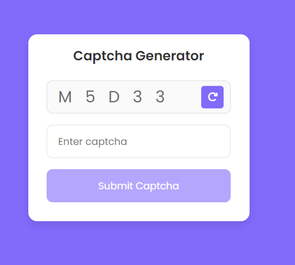

# Captcha Generator

## Overview
The Captcha Generator is a security tool designed to create unique and unpredictable tests to differentiate between human users and automated bots. This project is developed using HTML, CSS, and JavaScript, ensuring a seamless integration into web applications with a focus on user-friendly design and robust functionality.

## Features
* HTML Structure: Clear and semantic structure for Captcha elements.
* CSS Styling: Visually appealing and accessible design, with responsive layouts.
* JavaScript Functionality: Handles random challenge generation, user response validation, and feedback.

## Installation
* Clone the repository:

```bash
git clone https://github.com/yourusername/captcha-generator.git
``` 

* Navigate to the project directory:

```bash
cd captcha-generator
```

* Open index.html in your preferred web browser.

## Usage
* Generate Captcha: When the page loads, a new Captcha challenge is automatically generated.
* Solve Captcha: Enter your response in the input field provided.
* Submit: Click the submit button to validate your response.
* Feedback: You will receive immediate feedback indicating whether your response was correct or incorrect.

## Project Structure

```bash
captcha-generator/
│
├── index.html      # Main HTML file
├── style.css       # CSS file for styling
├── script.js       # JavaScript file for functionality
```
## Screenshots

