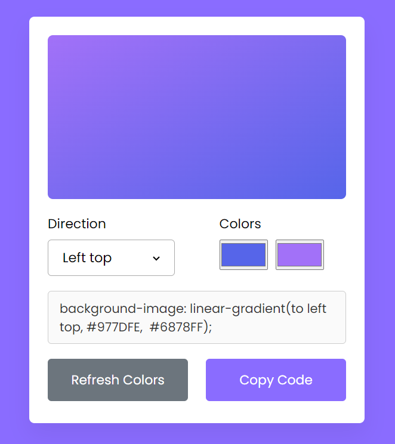

# Gradient Color Generator
This project is a simple Gradient Color Generator built using HTML, CSS, and JavaScript. The application allows users to generate linear gradients by selecting two colors and displays the corresponding CSS code for the gradient.

## Features
* User-friendly interface for selecting two colors
* Real-time display of the generated gradient
* Copy-to-clipboard functionality for the CSS code
* Responsive design suitable for all screen sizes

## Getting Started
To get a local copy up and running, follow these simple steps.

* Prerequisites
You will need a modern web browser to view the project.

* Installation
1. Clone the repository:

```bash
git clone https://github.com/your-username/gradient-color-generator.git
```

2. Open the project directory:

```bash
cd gradient-color-generator
```

3. Open index.html in your web browser:

```bash
open index.html
```

## Usage
* Open the Gradient Color Generator in your browser.
* Use the color pickers to select two colors.
* The gradient will be updated in real-time.
* Copy the generated CSS code by clicking the "Copy" button.

## Code Overview
* HTML
The HTML file contains the structure of the application, including color pickers and a display area for the gradient and CSS code.

* CSS
The CSS file includes styles for the layout and design of the application.

* JavaScript
The JavaScript file handles the functionality of the color pickers, generates the gradient, and updates the CSS code.

## Screenshot


 